# Frontend - Sistema de Reservas de Laboratorios

Este proyecto es la interfaz de usuario del **Sistema de Reservas de Laboratorios**, desarrollado con **React**. Permite a los usuarios autenticarse, visualizar laboratorios disponibles, hacer reservas, y gestionar su perfil según su rol (usuario o administrador).

## 🌐 Tecnologías Utilizadas

- **React**
- **React Router DOM**
- **Axios** para consumo de API REST
- **Tailwind CSS** para estilos
- **Vite** como empaquetador (dev server rápido)
- **JWT** para autenticación y autorización (vía API)

## 📁 Estructura del Proyecto


## 🚀 Funcionalidades

- **Login con JWT**: Inicio de sesión usando token JWT (por rol: admin/user)
- **Registro de usuarios**: Solo permitido si el token es de administrador
- **Visualización de laboratorios** y sus disponibilidades
- **Gestión de reservas**:
    - Usuarios ven solo sus reservas
    - Admins ven todas las reservas
    - Cada usuario puede cancelar su propia reserva
- **Vista de perfil**: Muestra ID, nombre y email del usuario autenticado
- **Validación de formularios** y mensajes de error
- **Diseño responsive y minimalista con Tailwind**

## 🔐 Autenticación

- El token JWT es almacenado en `localStorage` tras iniciar sesión.
- Las peticiones a endpoints protegidos incluyen el header:


## 📦 Dependencias principales
```
Authorization: Bearer <token>

"dependencies": {
  "axios": "^1.6.8",
  "react": "^18.2.0",
  "react-dom": "^18.2.0",
  "react-router-dom": "^6.22.3"
}
```


```


```

## 🖼️ Capturas de Pantalla
### 🧑 Inicio de Sesión
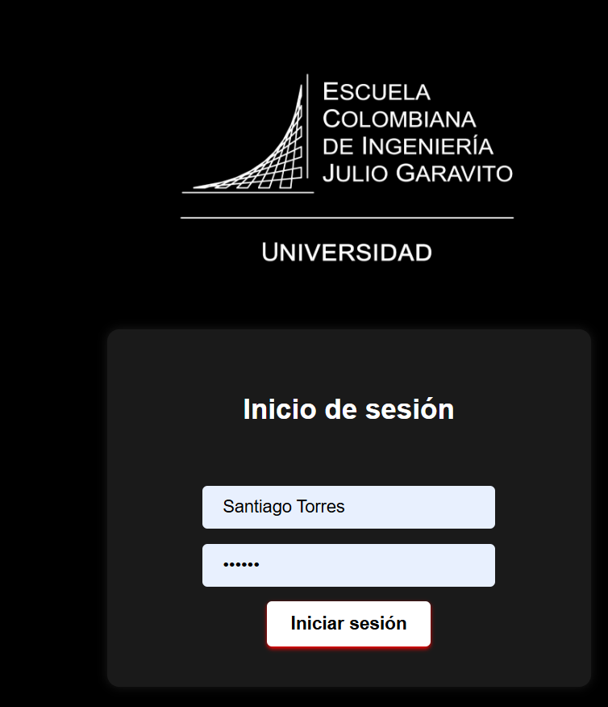
### 🧾 Vista Principal
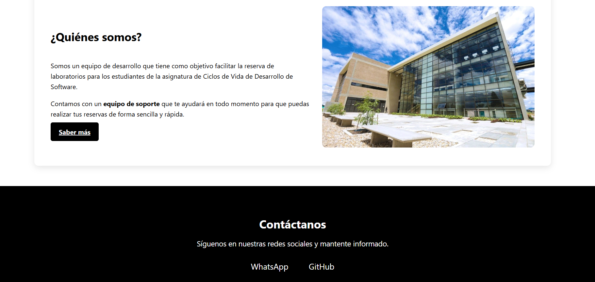
### 📋 Imagenes
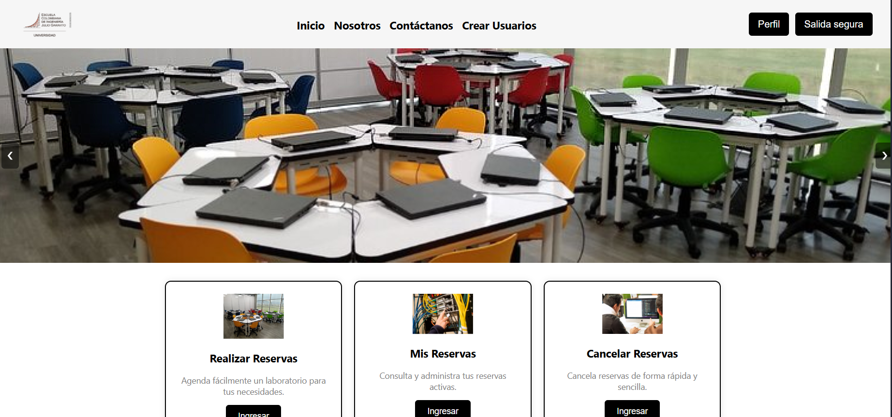


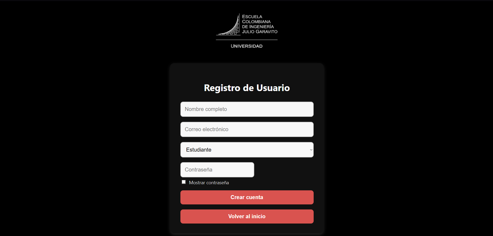

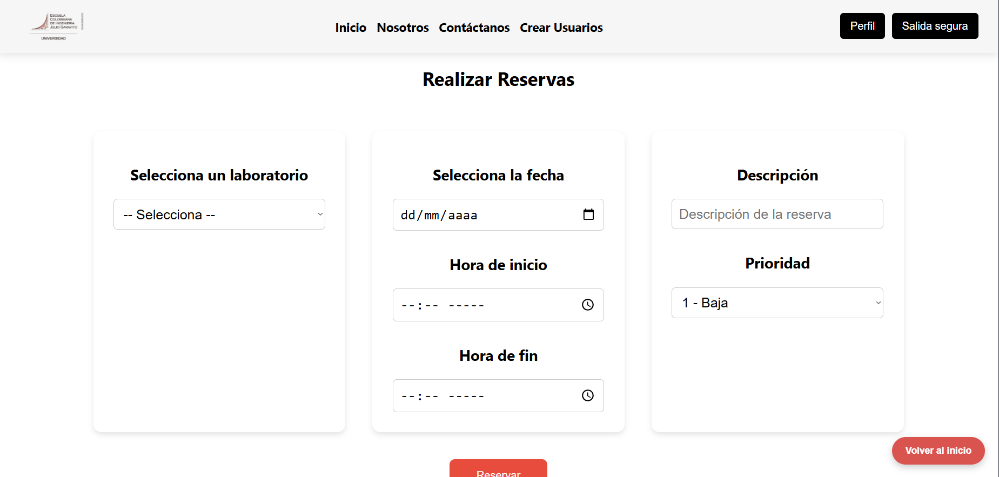

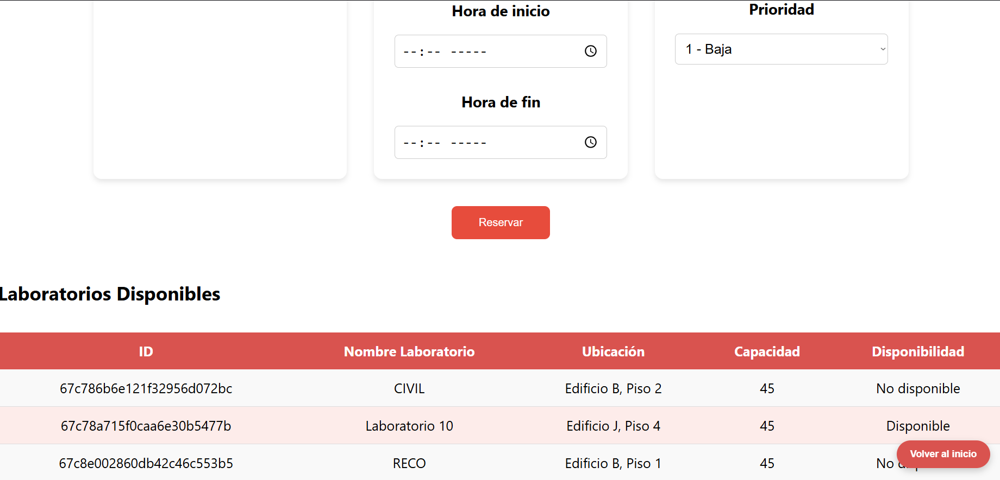

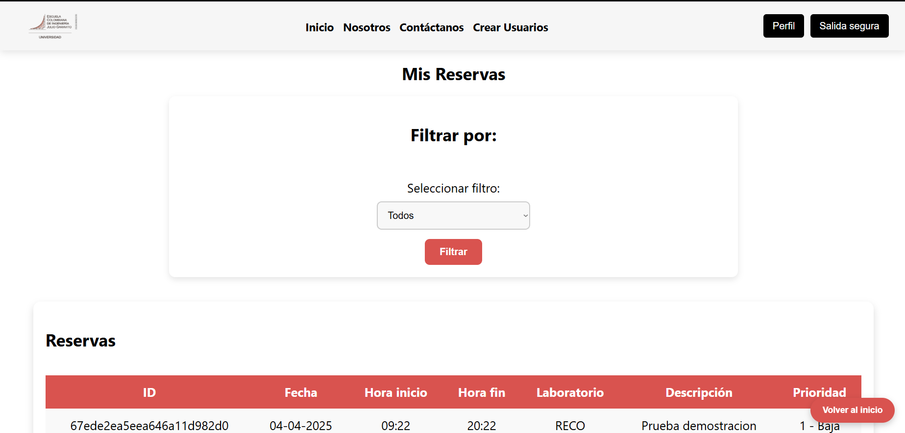

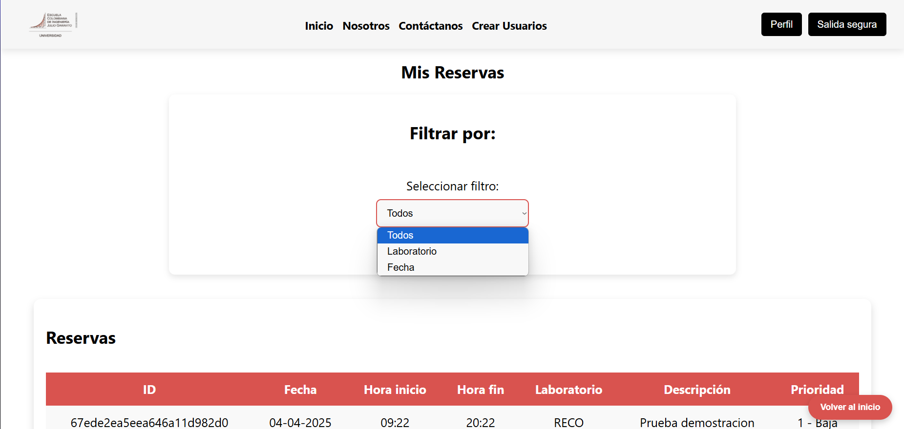

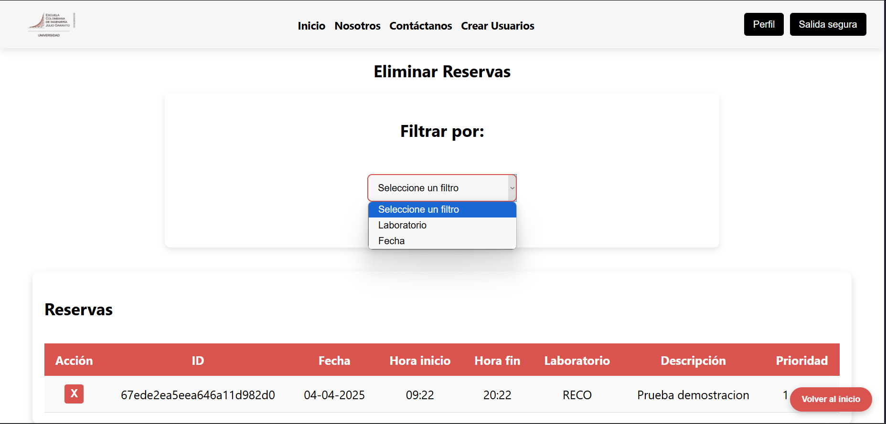

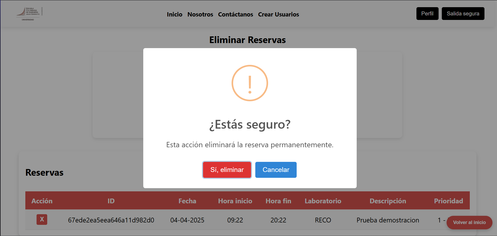

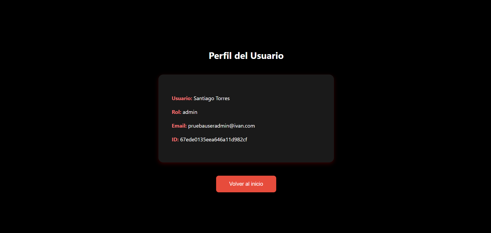